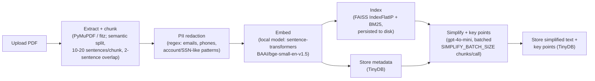

# AI Document Simplifier — Architecture

**Prodapt Hackathon — Group 17**

This document describes what the system **actually does right now**, built
and verified end-to-end during this build. Where the original plan changed
along the way, this reflects the current decision, not the original one.
Anything discussed but not built is called out explicitly in
[Scope for Future Improvement](#scope-for-future-improvement) rather than
described as done.

## Problem Statement

Build an AI tool that simplifies complex documents (policies, reports, manuals, agreements) while highlighting key points and answering user questions about them.

## Tech Stack

| Layer | Choice | Why |
|---|---|---|
| Backend | FastAPI (Python) | Async-friendly, fast to stand up, clean REST layer |
| Frontend | Streamlit | Fastest path to a working UI for a time-boxed hackathon build |
| PDF extraction | PyMuPDF (import name `fitz`) | — |
| Chunking | Custom **semantic** sentence-based chunker — not LangChain's `SemanticChunker` or any off-the-shelf implementation, hand-rolled like the rest of this pipeline. Sentences (via a lightweight regex splitter, not an NLP tokenizer) are embedded with the same local embedding model used for retrieval; each chunk is bounded to `CHUNK_MIN_SENTENCES`–`CHUNK_MAX_SENTENCES` (default 10–20) sentences, but the exact cut point within that band is placed at the lowest consecutive-sentence similarity (the most likely real topic shift), 2-sentence overlap (`CHUNK_OVERLAP_SENTENCES`). **This replaced an earlier word-count-based design** (150 words/chunk, 30-word overlap) that didn't respect sentence boundaries. | Chunk boundaries land on actual topic shifts rather than a fixed sentence/word count, while the min/max band avoids the pathologically tiny/huge chunks an unbounded semantic splitter can produce on very uniform or very choppy text |
| Embeddings | Local, via `sentence-transformers`, model `BAAI/bge-small-en-v1.5` (384-dim vectors). Loaded once at app startup, not per-request. | Chosen over an API-based embedding model (e.g. OpenAI) specifically to avoid per-request network latency during upload and to remove a dependency on venue wifi during the live demo |
| Vector search | FAISS (`IndexFlatIP`, cosine similarity via normalized vectors), one index per uploaded document. **Persisted to disk** (`backend/faiss_indices/{doc_id}.faiss` + a `.meta.pkl` sidecar holding the paired BM25 index, chunk_ids, and chunk_texts) and lazily reloaded into memory on first access after a restart. **This replaced an earlier in-memory-only design** that lost every index on restart — verified fixed by a full backend kill-and-restart test, then asking a question about a pre-restart document with zero re-upload. | — |
| Keyword search | BM25 (`rank_bm25` library), combined with FAISS via reciprocal rank fusion (RRF) for hybrid retrieval | — |
| Metadata / document store | TinyDB (embedded NoSQL, single JSON file at `backend/db/db.json`) | Chosen over MongoDB to avoid a server/Docker dependency in a 3.5-hour build |
| Raw file storage | Local folder (`backend/uploaded_docs/`) | Prototype-appropriate; **not** intended as the production storage design |
| LLM | OpenAI `gpt-4o-mini` | Used for simplification, key-point extraction, and grounded Q&A. Simplification + key points run eagerly at upload time (not on-demand), batched `SIMPLIFY_BATCH_SIZE` (default 5) chunks per call to reduce call volume on large documents — e.g. a 542-chunk document is ~109 calls, not 542. **This batching was added after observing the original one-call-per-chunk design take 20+ minutes on a 194-page PDF.** Q&A calls are separate and additional, one per question asked. |
| Observability | LangSmith, via the `@traceable` decorator on LLM-calling functions | Implemented and wraps every LLM call; tracing is a no-op unless `LANGCHAIN_TRACING_V2`/`LANGCHAIN_API_KEY` are set. **Not yet exercised against a real LangSmith account in this build** — see Scope for Future Improvement. |

### Guardrails — current status

- **PII redaction** — regex-based (emails, phone numbers, account/SSN-like patterns), applied before any text reaches the LLM or gets embedded/indexed. **Active by default. Verified**: directly inspected stored chunk text after upload and confirmed zero raw PII, only redaction placeholders.
- **Prompt injection detection** — a DeBERTa-based text classifier, `protectai/deberta-v3-base-prompt-injection-v2`, loaded at startup. **Currently disabled by default in this environment** (`ENABLE_PROMPT_INJECTION_CHECK=false` in `.env`) — its ~700MB first-time download was too slow/unreliable on this network mid-build, and it was deprioritized in favor of getting the core pipeline working. The code path itself works (fails open with a logged warning if the model can't load, rather than crashing); the classifier's real-world accuracy has not been evaluated end-to-end. Flip `ENABLE_PROMPT_INJECTION_CHECK=true` to re-enable.
- **Scope validation** — reject/flag queries where the top retrieval similarity score falls below a threshold (0.3), indicating the question is likely off-topic. **Active by default. Verified, with a caveat**: tested with a deliberately off-topic question, and the 0.3 threshold alone did *not* catch it (the top score came in ≥0.3 anyway) — it was still handled safely because the LLM declined to answer from irrelevant context and citation validation backed that up. So this guardrail works as a layer of defense-in-depth, not as a fully reliable standalone filter at the current threshold.
- **Output validation** — the LLM must return answers in JSON with a `citations` field listing chunk IDs used; the backend verifies every cited chunk ID was actually part of the retrieved context before returning the answer. **Active by default. Verified**: confirmed correct citation matching in real Q&A tests, and confirmed the guardrail's block path fires when citations don't validate.

## System Architecture

Two separate flows: an ingestion/indexing pipeline that runs once per uploaded document, and a query-time pipeline that runs once per user question.

### 1. Ingestion / Indexing Pipeline (once per uploaded document)



Note: this simplify + key-points step runs eagerly, for every chunk, as part of the upload request — it happens before any question is asked, not on-demand. This was a deliberate original design choice (not a bug), though it does mean large documents take a while to upload — see Tech Stack above.

### 2. Query-Time Pipeline (once per user question)


Note: the prompt injection check shown here is currently **disabled by default** in this environment (`ENABLE_PROMPT_INJECTION_CHECK=false`) — see Guardrails above. The scope check, hybrid retrieval, LLM call, and output validation are all active by default.

## Data Model

The metadata/document store is TinyDB (`backend/db.py`), organized into four tables/collections: `documents`, `chunks`, `key_points`, and `qa_history`. Field names below are read directly from the implementation (`backend/routes/documents.py`, `backend/routes/qa.py`).

- **`documents`** — one record per uploaded document (created during ingestion):
  `doc_id`, `filename`, `content_type` (`"pdf"` | `"txt"`), `upload_time`, `file_path`, `num_chunks`, `word_count`, `status` (`"processing"` | `"ready"` | `"failed"`), `error`.
- **`chunks`** — one record per text chunk produced by the chunker, post-PII-redaction (created during ingestion; referenced by ID from citations at query time):
  `chunk_id` (`"{doc_id}::{chunk_index}"`), `doc_id`, `chunk_index`, `text` (redacted), `sentence_start`, `sentence_end`, `pii_redacted` (bool).
- **`key_points`** — simplified text + extracted key points, one record per chunk/"section" (created by the LLM simplify step):
  `id`, `doc_id`, `chunk_id`, `chunk_index`, `simplified_text`, `key_points` (list of strings).
- **`qa_history`** — one record per user question asked in the chat box (created by the query-time pipeline):
  `id`, `doc_id`, `question`, `answer` (`None` if blocked), `citations` (list of chunk IDs), `blocked` (bool), `block_reason` (`None` | `"prompt_injection_detected"` | `"out_of_scope"` | `"citation_validation_failed"`), `timestamp`.

## Folder Structure

Actual repository structure as of this writing:

```
AI_Document-Simplifier/
├── .claude/
│   └── settings.local.json
├── .env.example
├── .gitignore
├── ARCHITECTURE.md              # this file
├── README.md
├── SETUP_INSTRUCTIONS.md         # fresh-clone setup walkthrough + troubleshooting
├── requirements.txt
├── start.bat                    # Windows: launch backend + frontend together
├── docker-compose.yml
├── faiss-service/              # pre-existing, unused — see note below
│   ├── .dockerignore
│   ├── Dockerfile
│   ├── main.py
│   ├── requirements.txt
│   └── test_client.py
├── backend/                     # FastAPI app
│   ├── __init__.py
│   ├── main.py                  # app entrypoint, startup model loading
│   ├── config.py                # env-driven settings
│   ├── db.py                    # TinyDB tables
│   ├── uploaded_docs/           # raw file storage (gitignored contents)
│   ├── db/                      # TinyDB json file (gitignored contents)
│   ├── faiss_indices/           # persisted FAISS + BM25 indices, one pair per doc_id (gitignored contents)
│   ├── pipeline/
│   │   ├── extraction.py        # PyMuPDF text extraction
│   │   ├── chunking.py          # semantic sentence-based chunker
│   │   ├── pii_redaction.py     # regex PII redaction
│   │   ├── embeddings.py        # sentence-transformers (BAAI/bge-small-en-v1.5)
│   │   ├── indexing.py          # per-document FAISS + BM25 indices (persisted to disk)
│   │   └── retrieval.py         # hybrid retrieval, RRF fusion
│   ├── llm/
│   │   ├── client.py            # OpenAI client
│   │   ├── simplify.py          # simplification + key points, batched (traced)
│   │   └── qa.py                # grounded Q&A (traced)
│   ├── guardrails/
│   │   ├── prompt_injection.py  # DeBERTa classifier wrapper (currently disabled by default)
│   │   ├── scope.py             # similarity-threshold check
│   │   └── output_validation.py # citation verification
│   └── routes/
│       ├── documents.py         # ingestion pipeline route
│       └── qa.py                # query-time pipeline route
└── frontend/                    # Streamlit app
    └── app.py
```

Per-file docstrings cross-reference the relevant section of this document. Setup/run instructions are in [README.md](README.md) and [SETUP_INSTRUCTIONS.md](SETUP_INSTRUCTIONS.md).

**Note on `faiss-service/`:** this Docker microservice predates the architecture decisions above and is not wired into the backend — it's a generic, single-shared-index FAISS HTTP wrapper, which doesn't match this app's per-document design. It's left in the repository unused rather than integrated or deleted.

## Step-by-Step Workflow (User-Facing)

1. User uploads a PDF/txt document via Streamlit.
2. Backend extracts text, chunks it semantically, redacts PII, embeds locally, builds FAISS + BM25 indices (persisted to disk), stores metadata.
3. Backend returns a simplified version of each section plus extracted key points.
4. User can ask questions in a chat box; each question passes through guardrails, hybrid retrieval, a grounded LLM call, and output validation before the answer is shown, with cited source chunks.

## Implementation Status

What's actually built and confirmed working, versus what's still just an idea.

### Implemented and verified

Everything below was directly tested during this build (real uploads, real questions, real restarts, direct inspection of stored data) — not just written and assumed to work:

- Full ingestion pipeline: extraction, semantic chunking, PII redaction, local embedding, FAISS + BM25 indexing, TinyDB metadata storage
- FAISS + BM25 persistence to disk, surviving a full backend restart with no re-upload
- Batched simplification + key-point extraction
- Hybrid retrieval (BM25 + FAISS + RRF fusion) and grounded Q&A with citations
- Output validation (citation checking)
- PII redaction (verified directly against stored data)
- Scope validation (active, with the reliability caveat noted above)
- FastAPI backend + Streamlit frontend, wired together and running
- `start.bat` one-command launcher for both servers

### Implemented but not fully active or verified

- **Prompt injection classifier** — code complete, currently disabled by default in this environment (see Guardrails above); not evaluated against real injection attempts
- **LangSmith tracing** — code complete on every LLM call; never run against a real LangSmith account/API key in this build, so actual trace output is unverified (the "skip tracing when unconfigured" path is what's actually been exercised)

### Scope for Future Improvement

Discussed and deliberately not built, or identified as a gap during the build — not started:

- **No content-based upload deduplication** — every upload gets a fresh random `doc_id` and a full independent processing run, even for byte-identical content re-uploaded. Discussed explicitly during the build and deferred by choice.
- **No document-delete API endpoint** — cleanup of test/orphaned documents during this build was done via one-off scripts operating directly on TinyDB and the filesystem, not through the application itself.
- **No OCR support** — scanned/image-only PDFs return empty extracted text and fail ingestion; not addressed.
- **No automated test suite** — all verification in this build was manual/scripted (curl requests, direct database inspection), not repeatable automated tests.
- **Scope-threshold guardrail tuning** — the 0.3 cosine-similarity threshold has a known gap (see Guardrails above); could be tuned or supplemented with a proper empirical evaluation against real in-scope/out-of-scope questions.
- **`faiss-service/`** — the pre-existing Docker microservice in this repo remains unused; a future direction could be to actually adopt it (or a similar persistent vector service) instead of the current per-document file-based approach, if this grows beyond prototype scale.

## Known Limitations

Permanent, accepted tradeoffs of the current design (as opposed to unfinished work above):

- Local folder storage and TinyDB are prototype-appropriate, not production storage choices.
- If a document's `backend/faiss_indices/{doc_id}.*` files are deleted or corrupted while its TinyDB record still says `status: "ready"`, asking a question about it will fail with a clear "no index found" error rather than silently breaking — re-uploading the document is the fix.
- Sentence splitting for chunking uses a lightweight regex heuristic, not an NLP sentence tokenizer — it can mis-split on abbreviations (e.g. "Dr.", "e.g."), occasionally shifting a chunk boundary earlier or later than a true sentence break. It doesn't corrupt chunk text, just makes boundaries imperfect in edge cases.
- Semantic chunking embeds every sentence once (locally) purely to pick chunk boundaries — this is extra local computation beyond the per-chunk embedding used for indexing, though still no OpenAI cost/latency since it's the same local model. Those boundary-detection embeddings run on raw, pre-PII-redaction sentence text; this is fine only because that model is 100% local (nothing leaves the process) — redaction still happens per-chunk before anything is indexed, displayed, or sent to the LLM.
