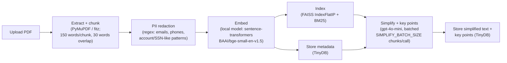

# AI Document Simplifier — Architecture

**Prodapt Hackathon — Group 17**

## Problem Statement

Build an AI tool that simplifies complex documents (policies, reports, manuals, agreements) while highlighting key points and answering user questions about them.

## Tech Stack

| Layer | Choice | Why |
|---|---|---|
| Backend | FastAPI (Python) | Async-friendly, fast to stand up, clean REST layer |
| Frontend | Streamlit | Fastest path to a working UI for a time-boxed hackathon build |
| PDF extraction | PyMuPDF (import name `fitz`) | — |
| Chunking | Custom word-based chunker — 150 words per chunk, 30 words overlap (20%) | — |
| Embeddings | Local, via `sentence-transformers`, model `BAAI/bge-small-en-v1.5`. Loaded once at app startup, not per-request. | Chosen over an API-based embedding model (e.g. OpenAI) specifically to avoid per-request network latency during upload and to remove a dependency on venue wifi during the live demo |
| Vector search | FAISS (`IndexFlatIP`, cosine similarity via normalized vectors), one index per uploaded document | — |
| Keyword search | BM25 (`rank_bm25` library), combined with FAISS via reciprocal rank fusion (RRF) for hybrid retrieval | — |
| Metadata / document store | TinyDB (embedded NoSQL, JSON-file-backed) | Chosen over MongoDB to avoid a server/Docker dependency in a 3.5-hour build |
| Raw file storage | Local folder (`backend/uploaded_docs/`) | Prototype-appropriate; **not** intended as the production storage design |
| LLM | OpenAI `gpt-4o-mini` | Used for simplification, key-point extraction, and grounded Q&A. Simplification + key points run eagerly at upload time (not on-demand), batched `SIMPLIFY_BATCH_SIZE` (default 5) chunks per call to reduce call volume on large documents — e.g. a 542-chunk document is ~109 calls, not 542. Q&A calls are separate and additional, one per question asked. |
| Observability | LangSmith, via the `@traceable` decorator on LLM-calling functions | — |

### Guardrails

- **PII redaction** — regex-based (emails, phone numbers, account/SSN-like patterns), applied before any text reaches the LLM.
- **Prompt injection detection** — a DeBERTa-based text classifier, `protectai/deberta-v3-base-prompt-injection-v2`. **This exact model ID should be verified against HuggingFace before relying on it** — it has not been confirmed at the time of writing.
- **Scope validation** — reject/flag queries where the top retrieval similarity score falls below a threshold (0.3), indicating the question is likely off-topic for the uploaded document.
- **Output validation** — the LLM must return answers in JSON with a `citations` field listing chunk IDs used; the backend verifies every cited chunk ID was actually part of the retrieved context before returning the answer to the user.

## System Architecture

Two separate flows: an ingestion/indexing pipeline that runs once per uploaded document, and a query-time pipeline that runs once per user question.

### 1. Ingestion / Indexing Pipeline (once per uploaded document)



Note: this simplify + key-points step runs eagerly, for every chunk, as part of the upload request — it happens before any question is asked, not on-demand. See Tech Stack above and Known Limitations below.

### 2. Query-Time Pipeline (once per user question)


## Data Model

The metadata/document store is TinyDB (`backend/db.py`), organized into four tables/collections: `documents`, `chunks`, `key_points`, and `qa_history`. Field names below are read directly from the implementation (`backend/routes/documents.py`, `backend/routes/qa.py`).

- **`documents`** — one record per uploaded document (created during ingestion):
  `doc_id`, `filename`, `content_type` (`"pdf"` | `"txt"`), `upload_time`, `file_path`, `num_chunks`, `word_count`, `status` (`"processing"` | `"ready"` | `"failed"`), `error`.
- **`chunks`** — one record per text chunk produced by the chunker, post-PII-redaction (created during ingestion; referenced by ID from citations at query time):
  `chunk_id` (`"{doc_id}::{chunk_index}"`), `doc_id`, `chunk_index`, `text` (redacted), `word_start`, `word_end`, `pii_redacted` (bool).
- **`key_points`** — simplified text + extracted key points, one record per chunk/"section" (created by the LLM simplify step):
  `id`, `doc_id`, `chunk_id`, `chunk_index`, `simplified_text`, `key_points` (list of strings).
- **`qa_history`** — one record per user question asked in the chat box (created by the query-time pipeline):
  `id`, `doc_id`, `question`, `answer` (`None` if blocked), `citations` (list of chunk IDs), `blocked` (bool), `block_reason` (`None` | `"prompt_injection_detected"` | `"out_of_scope"` | `"citation_validation_failed"`), `timestamp`.

## Folder Structure

Actual repository structure as of this writing:

```
AI_Document-Simplifier/
├── .claude/
│   └── settings.local.json
├── .env.example
├── .gitignore
├── README.md
├── requirements.txt
├── start.bat                    # Windows: launch backend + frontend together
├── docker-compose.yml
├── docs/
│   └── ARCHITECTURE.md
├── faiss-service/              # pre-existing, unused — see note below
│   ├── .dockerignore
│   ├── Dockerfile
│   ├── main.py
│   ├── requirements.txt
│   └── test_client.py
├── backend/                     # FastAPI app
│   ├── __init__.py
│   ├── main.py                  # app entrypoint, startup model loading
│   ├── config.py                # env-driven settings
│   ├── db.py                    # TinyDB tables
│   ├── uploaded_docs/           # raw file storage (gitignored contents)
│   ├── db/                      # TinyDB json file (gitignored contents)
│   ├── pipeline/
│   │   ├── extraction.py        # PyMuPDF text extraction
│   │   ├── chunking.py          # word-based chunker
│   │   ├── pii_redaction.py     # regex PII redaction
│   │   ├── embeddings.py        # sentence-transformers (BAAI/bge-small-en-v1.5)
│   │   ├── indexing.py          # per-document FAISS + BM25 indices (in-memory)
│   │   └── retrieval.py         # hybrid retrieval, RRF fusion
│   ├── llm/
│   │   ├── client.py            # OpenAI client
│   │   ├── simplify.py          # simplification + key points (traced)
│   │   └── qa.py                # grounded Q&A (traced)
│   ├── guardrails/
│   │   ├── prompt_injection.py  # DeBERTa classifier wrapper
│   │   ├── scope.py             # similarity-threshold check
│   │   └── output_validation.py # citation verification
│   └── routes/
│       ├── documents.py         # ingestion pipeline route
│       └── qa.py                # query-time pipeline route
└── frontend/                    # Streamlit app
    └── app.py
```

Per-file docstrings cross-reference the relevant section of this document. Setup/run instructions are in [README.md](../README.md).

**Note on `faiss-service/`:** this Docker microservice predates the architecture decisions above and is not wired into the backend — it's a generic, single-shared-index, disk-persisted FAISS HTTP wrapper, which doesn't match the documented design (one in-memory, non-persisted index per uploaded document, used directly inside the FastAPI process). It's left in the repository unused rather than integrated or deleted; see README.md for details.

## Step-by-Step Workflow (User-Facing)

1. User uploads a PDF/txt document via Streamlit.
2. Backend extracts text, chunks it, redacts PII, embeds locally, builds FAISS + BM25 indices, stores metadata.
3. Backend returns a simplified version of each section plus extracted key points.
4. User can ask questions in a chat box; each question passes through guardrails, hybrid retrieval, a grounded LLM call, and output validation before the answer is shown, with cited source chunks.

## Implementation Plan

Phased, not tied to fixed clock times — the actual team schedule lives elsewhere.

- **Phase 1** — Ingestion pipeline (extract, chunk, PII redact) — code in `backend/pipeline/{extraction,chunking,pii_redaction}.py`
- **Phase 2** — Embedding + indexing (local model, FAISS, BM25) — code in `backend/pipeline/{embeddings,indexing,retrieval}.py`
- **Phase 3** — LLM integration (simplify, key points, grounded Q&A) — code in `backend/llm/`
- **Phase 4** — Guardrails (injection check, scope check, output validation) — code in `backend/guardrails/`
- **Phase 5** — FastAPI routes + Streamlit UI integration — code in `backend/routes/`, `backend/main.py`, `frontend/app.py`
- **Phase 6** — Observability (LangSmith `@traceable`, in `backend/llm/`), documentation. **Not yet done: testing and demo rehearsal** — the code has not been installed, run, or tested end-to-end (see README.md).

## Known Limitations

- In-memory FAISS indices are not persisted across server restarts; TinyDB metadata is, but a restart requires re-uploading documents to rebuild vector indices.
- Local folder storage and TinyDB are prototype-appropriate, not production storage choices.
- No OCR support — scanned/image-only PDFs will return empty extracted text.
- Prompt injection classifier model ID should be verified before demo day.
